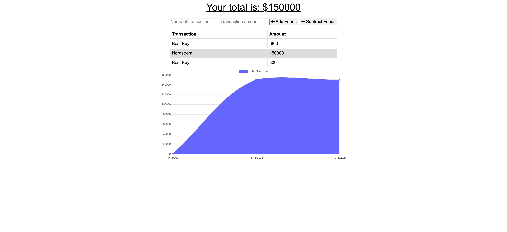

# ProgressiveBudget | 

I have refactored a budget tracker app where users can add expenses and deposits to their budget with or without a connection. When entering transactions offline, they should populate the total when brought back online.

Offline Functionality:

  * Enter deposits offline

  * Enter expenses offline

When brought back online:

  * Offline entries should be added to tracker.

# User Story

AS AN avid traveller
I WANT to be able to track my withdrawals and deposits with or without a data/internet connection
SO THAT my account balance is accurate when I am traveling

# Business Context

Giving users a fast and easy way to track their money is important, but allowing them to access that information anytime is even more important. Having offline functionality is paramount to our applications success.

# Acceptance Criteria
GIVEN a user is on Budget App without an internet connection
WHEN the user inputs a withdrawal or deposit
THEN that will be shown on the page, and added to their transaction history when their connection is back online.

# Screenshot

# Deployed Links

[Link to Github](https://mlh19.github.io/ProgressiveBudget/)

[Link to Heroku](https://best-progressive-budget.herokuapp.com/)

# Other Details

- Refactored using class assignments with help from my tutor.

- Let's Connect on GitHub! [mlh19](https://www.github.com/mlh19)

- Email Me! [ml.hoover@yahoo.com](mailto:ml.hoover@yahoo.com)

